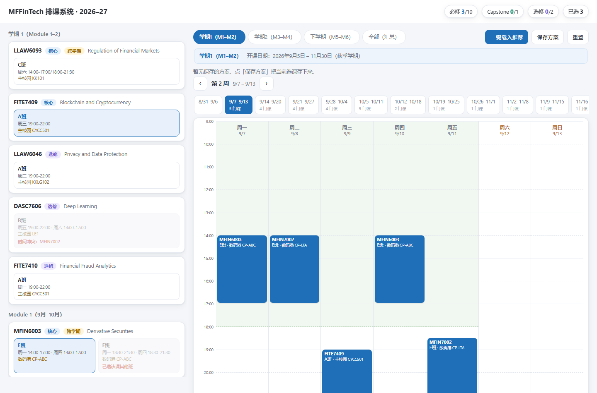
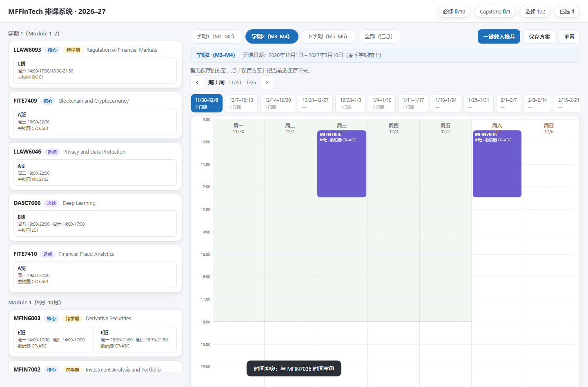
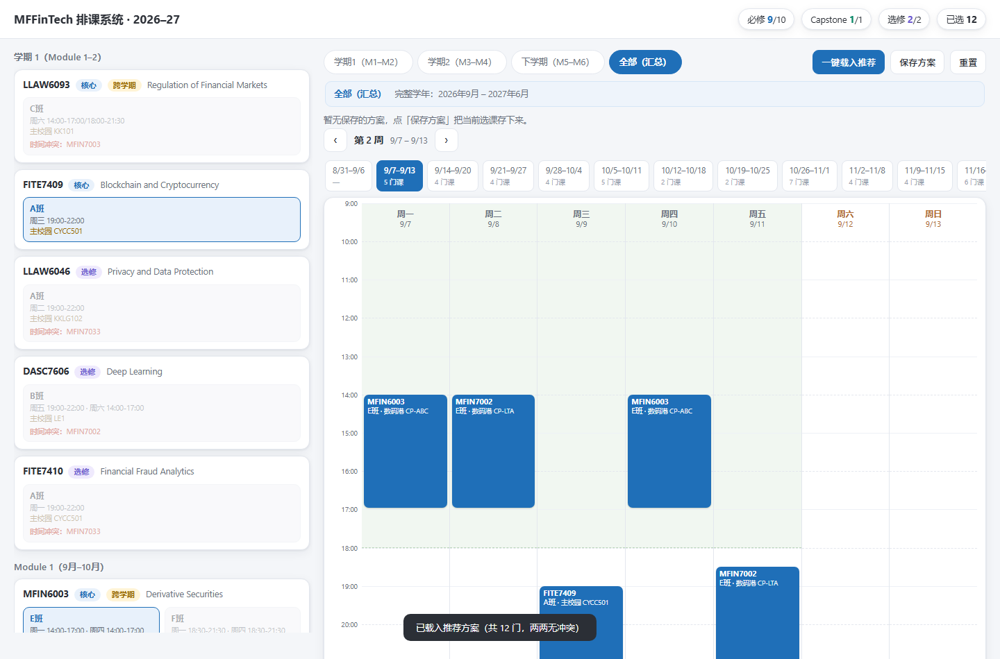
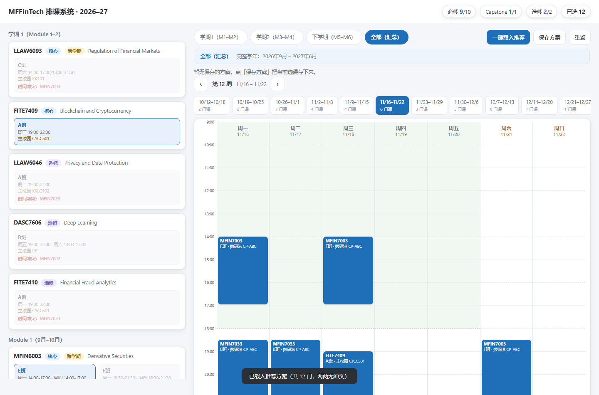

# MFFinTech 排课系统 · 单文件交互式选课排课器

> 一项可以帮助港大学生可视化课表的排课工具：真实开课日期驱动、冲突自动检测、方案一键复用。

## 项目背景
课程横跨 6 个 Module（2026.09–2027.06），需在「排课密集 + M3 后实习」约束下选课；官方教学计划只是静态表格，跨模块时间冲突无法直观判断。故自建排课系统，把 Teaching Plan 的真实开课日期结构化并可视化。

## 核心能力
| 能力 | 说明 |
|---|---|
| 真实日期驱动 | 42 个课程班、402 个真实上课日（来自教学计划 PDF），按日期而非星期排布 |
| 冲突自动检测 | 按真实日期+时间区间重叠判定，重叠班次自动灰显并提示与哪门课冲突 |
| 按周滑动视图 | 周条 + 上一周/下一周切换（←/→），任意一周课表一目了然 |
| 分学期选课 | 学期1（M1–M2）/ 学期2（M3–M4）/ 下学期（M5–M6）/ 全部，分步选择 |
| 方案保存/导入 | localStorage 持久化，命名保存、点击卡片一键导入、多方案对比 |
| 一键推荐方案 | 内置 12 门两两无冲突组合（先修课与双时段优先、选修靠后） |
| 可复用 Skill 打包 | 制作流程沉淀为 course-timetable-builder（泛化模板 + 提取/构建/校验脚本），换任意专业数据即可生成同款页面 |

## 技术架构
单文件 HTML + 原生 JS，零依赖、零部署，双击即用。SECTIONS / SCOPES / PRESET 数据层与交互逻辑分离；冲突按真实时间区间重叠计算，星期由日期推导，规避官方数据「星期与日期不符」的坑。已沉淀为可复用 Skill（course-timetable-builder），换任意专业教学计划数据即可生成同款页面。

```
Teaching Plan PDF ──Python 提取+校验──▶ SECTIONS 数据（42班/402天）
                                              │
                                              ▼
                        单文件 index.html（数据 + 逻辑内嵌）
                          ├─ 分学期选课 ─▶ 冲突检测(区间重叠) ─▶ 按周视图
                          └─ 保存方案(localStorage) ─▶ 一键导入 / 推荐方案
```

## 可复用 Skill（course-timetable-builder）
整套制作流程已封装为可分发 Skill（zip 安装即用），同学换任意专业/学校的教学计划数据，即可生成同款交互式排课页面：

| 组成 | 作用 |
|---|---|
| assets/template.html | 泛化模板：SECTIONS / SCOPES / GROUPS / PRESET 等 6 个占位符，页面逻辑零改动 |
| scripts/extract_sections.py | 从教学计划数据提取并汇总班次，内置「日期↔星期」一致性校验 |
| scripts/build.py | 把数据文件注入模板，一键生成最终 HTML |
| scripts/verify_html.py | 校验占位符填全、冲突对数与数据规模 |
| references/ | 数据 schema 与 PDF 提取流程文档 |

> 压缩包随本交付附上：`course-timetable-builder.zip`，导入即可用。

## 界面截图
 **学期1（M1–M2）分步选课**：左侧按模块列出课程班次，选中后右侧周课表实时呈现。

 **冲突自动检测**：学期2视图下选中文本分析/NLP 后，与其重叠的班次自动灰显并弹出冲突提示。

 **一键载入推荐方案**：内置 12 门两两无冲突组合，先修与双时段课优先、选修靠后。

 **按周滑动视图**：周条 + 翻周按钮，横跨学期查看任意一周课表。

 **方案保存与一键导入**：命名保存当前选课，点击方案卡片即可整体导入。

## 项目亮点
- **数据层自动化**：从教学计划 PDF 结构化出 42 班 / 402 个真实上课日，内置「日期↔星期」一致性校验，规避官方数据错误。
- **可解释的冲突判定**：真实时间区间重叠计算，冲突时明确提示与哪门课重叠，而非简单标灰。
- **零部署自包含 + 可复用沉淀**：单文件双击即用；制作流程固化为 Skill 并打包分发，同学换专业数据即可复现，功能按真实使用痛点迭代。
