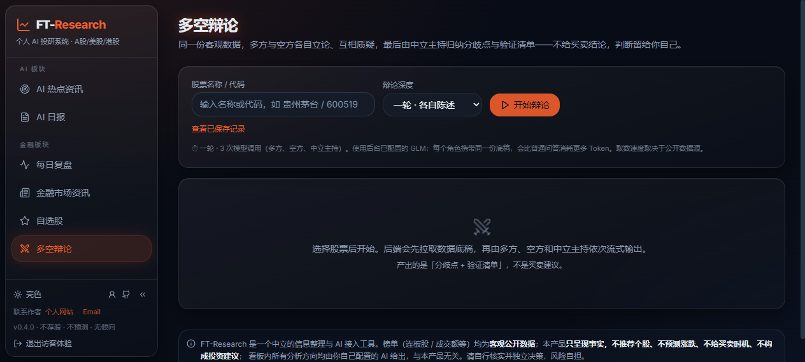

# FT-Research（金融 × AI 个人研究工作台）

> 整合 AI 金融资讯与 AI 对话的研究工作台：支持热点资讯追踪、每日市场复盘、个股研究与 AI 分析，帮助把分散信息收拢为可继续验证的研究线索。AI 在真实数据与页面上下文基础上协助梳理信息、生成分析与延续会话；产品不提供买卖建议。

## 项目背景

投研信息分散在资讯、行情与研报之间，AI 通常只能单点问答，难以沉淀为日常工作流。本项目围绕"**资讯 → 复盘 → 个股 → AI 会话**"重构产品链路，完成品牌化、权限体系与云端部署，把 AI 变成贯穿全站的协作能力。

**登录页首图**（公开落地页：品牌介绍与产品界面预览，点击「以访客身份体验」即可直接进入）



## 核心能力

| 能力 | 说明 |
|---|---|
| 每日市场复盘 | 汇总主要指数、市场情绪、板块资金、关注股票与全球市场信息，显示数据更新时间与异常状态；盘后由定时任务幂等生成结构化市场简报，可一键交给 AI 复盘 |
| 金融资讯与热点追踪 | 聚合财经新闻、公开 RSS 与 AI 热点内容，"证据优先"设计让每条要点可回溯原始来源；支持热点榜、订阅源管理与刷新状态提示 |
| 个股研究入口 | 支持名称/代码搜索（统一归一化 + 防抖，全站共享入口），个股页整合行情、财务、估值与新闻面板，上下文可直接带入 AI 对话 |
| AI 研究工作台 | 从复盘、资讯、指数或个股页携上下文进入；GLM 由服务端托管（Key 不出后端），NDJSON 流式回答、中断恢复、会话历史持久化并支持再次访问 |

## 技术架构

```
[公开数据源：行情 · 财经 RSS · AI HOT]
        │
        ▼
[FastAPI 后端] ── 证据优先聚合 · 按源刷新 · ETag 缓存/失败回退
        │
        ├─> [每日复盘快照 + 盘后定时简报（幂等调度）]
        │
        └─> [GLM-5.3-Flash · 服务端托管] ──NDJSON 流式──> [AI 会话工作台]
                  Key 不出后端，状态接口永不返回密钥         │
                                                   [SQLite 会话持久化]
                                                           │
                                          ├─ Owner：完整历史 + 数据边界
                                          └─ Guest：内存令牌 + 额度/工具权限限流
```

- **前端**：React 19 + TypeScript + Vite，导航重组为「AI 板块 + 金融板块」两级，新增公开 Landing Page 与完整 K 线历史
- **AI 链路**：浏览器只提交消息与页面上下文；回答流支持中断后恢复，研究框架可按问题自动路由
- **资讯链路**：财经新闻按证据链聚合、按发布时间排序；RSS 读取设置安全边界（限制重定向与响应体积）；AI HOT 代理带 ETag/304 缓存与 stale 标注回退
- **权限体系**：身份、IP、全站与输入长度多维限流；服务离线期间后台 AI 任务不自动重跑
- **交付**：腾讯云 Lighthouse 生产部署 + Docker/compose + 生产预检与备份脚本，约 90 个前后端测试覆盖流式、缓存、权限与搜索路径

## 在线访问

https://research.vincentli-website.com

## 界面截图

**每日市场复盘**（AI 收盘综述、大盘指数与市场结构一屏看全，数据更新时间与状态透明）


**金融市场资讯**（全球财经热点榜按重要性与多平台来源组织，要点可回溯原始出处）


**AI 热点资讯**（热点榜 Top 5 + 可排序/置顶/隐藏的 RSS 订阅流，来源刷新状态一目了然）


**个股研究与 AI 入口**（个股行情、估值与财务面板，一键将当前股票上下文带入 AI 会话）


## 项目亮点（面试可展开）

1. **AI 贯穿全站上下文**：资讯、复盘、指数、个股任意页面都能携带当前上下文进入 AI 会话，回答基于真实页面数据而非空泛问答；流式输出可中断恢复，会话历史持久化、随时回访延续。
2. **研究流程自动化**：每日 08:00 定时固化 AI 日报/周报/月报，盘后自动生成结构化市场复盘简报，热点榜与财经新闻自动聚合刷新——把每天手动收集信息的过程变成固定的自动化流程。
3. **真实上线可用的系统**：Owner/Guest 双角色隔离（访客独立预算与工具权限、令牌刷新即失效），GLM 密钥只存后端，腾讯云生产部署 + Docker 化交付，前后端约 90 个测试覆盖关键路径。
