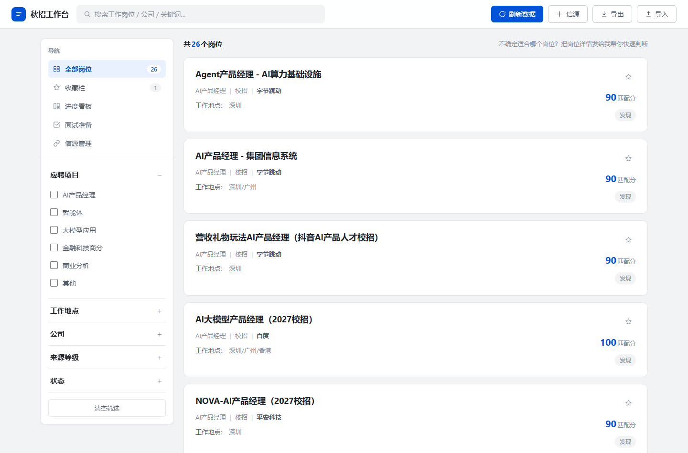
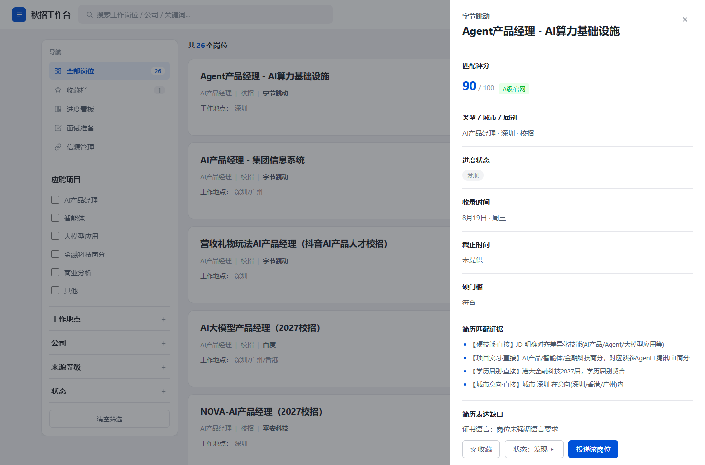
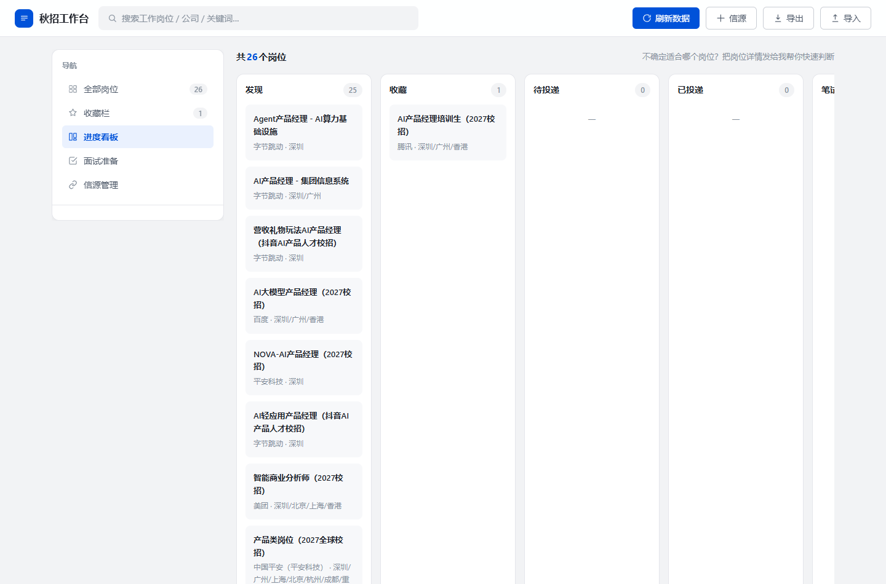
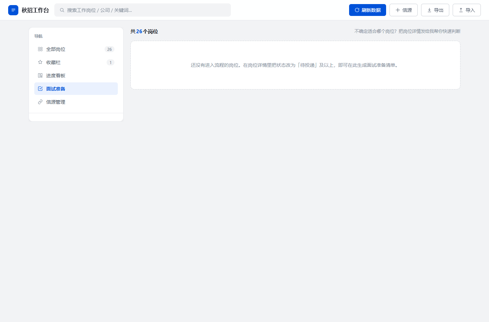
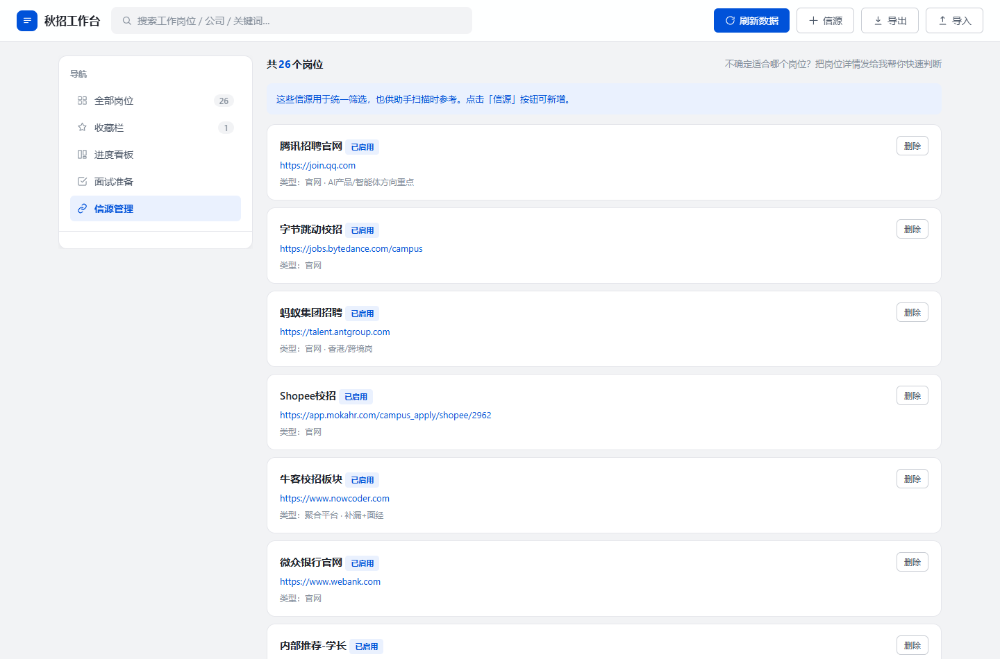

# 秋招工作台（AI 驱动的个人求职管理系统）

> 一个由 AI 每天自动扫描、匹配、管理秋招岗位的个人工作台：每天定时抓取 20+ 家公司官方招聘页，按候选人画像评分入库，生成可视化看板并自动发布到线上，让"找岗位"从重复劳动变成全自动闭环。

## 项目背景

秋招岗位分散在腾讯、字节、蚂蚁、平安等各家公司官网，人工每天逐一翻查 20+ 站点成本高、极易漏掉新岗位。本项目的目标是把"**自动发现 → 智能匹配 → 统一跟进**"做成一条完整闭环。

## 核心能力

| 能力 | 说明 |
|---|---|
| 每日自动扫描 | 定时任务驱动 AI 联网检索官方渠道（join.qq.com、jobs.bytedance.com 等），覆盖深圳/香港/广州，聚焦 AI 产品 / 智能体 / 大模型应用 / 金融科技商分方向 |
| 智能评分匹配 | 按候选人画像加权打分（硬技能 30 / 项目实习 25 / 学历届别 20 / 证书语言 10 / 城市意向 15），仅 ≥70 分岗位入库，过滤噪音 |
| 可视化工作台 | 腾讯招聘风格界面：全部 / 收藏 / 看板 / 面试 / 信源五大模块，多维度筛选，按日期分区追踪岗位新旧 |
| 进度闭环 | 收藏、投递状态流转、面试准备清单、数据导出备份 |
| 零部署成本 | 自包含单文件（数据内嵌 + 本地存储），双击即开、离线可用，并自动发布到 GitHub Pages |

## 技术架构

```
[每日定时任务] ──联网检索 20+ 公司官网──> [AI 评分筛选 ≥70] ──> [结构化 JSON]
      │
      ▼
[SQLite 入库（公司·岗位·城市三元组去重）] ──> [生成自包含 HTML]
                                          │
                                          ├─> 本地双击即开（离线可用）
                                          └─> git push ──> GitHub Pages 线上
```

- **前端**：原生 HTML/CSS/JS 单文件（约 86KB，零外部依赖），腾讯招聘风格 UI
- **数据层**：SQLite 持久化 + 浏览器本地存储（收藏/状态按岗位关联，重新生成页面不丢失）
- **去重策略**：`(公司, 岗位, 城市)` 三元组判重，已存在岗位跳过并保留用户进度，仅新岗位入库
- **发布链路**：扫描完成自动重新生成页面并 push 到 GitHub Pages，线上随时可见最新

## 线上地址

[https://lizhuoheng273-debug.github.io/workbench/](https://lizhuoheng273-debug.github.io/workbench/)

## 界面截图

**全部岗位**（默认视图：评分/等级/截止日一目了然）



**岗位详情**（点击任意岗位，右侧弹出抽屉：评分、状态、JD 与投递链接一览）



**看板**（按投递进度流转：发现 → 收藏 → 投递 → 笔试/面试 → 结果）



**面试准备**（按岗位维护准备清单，一键复制模拟面试指令）



**信源管理**（统一维护各招聘信息源，随时回查）



## 项目亮点（面试可展开）

1. **Agent 化工作流**：把"找岗位"从手工操作升级为可编排的自动化任务——定时触发、联网检索、评分筛选、去重双写、自动发布，每步失败均不阻断主流程。
2. **工程取舍**：为免去服务器部署成本，选择"单文件自包含 + 本地存储"方案，同时提供导出/导入备份兜底，兼顾便捷与数据安全。
3. **产品思维**：评分权重可解释（每分都能说出依据）、日期分区防止信息过载、状态流转贴合真实投递节奏（发现 → 收藏 → 投递 → 笔试/面试 → 结果）。
